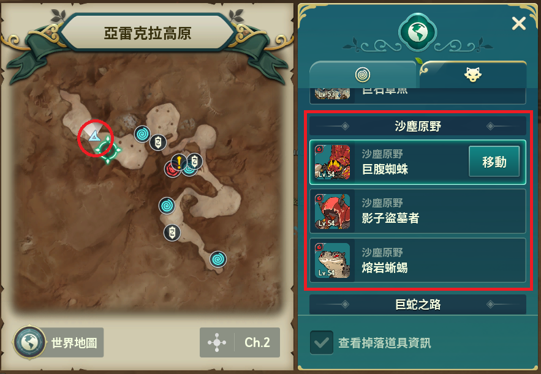

> [!TIP]
> 綠水(經驗值/金幣獲得量和戰利品700%)  
> 粉水(戰利品獲得率500%)  
> 都開等於12倍收益  

## 金幣

* 落地 3-34 等:  
    克雷納斯東部 - 無名洞窟

    

* 35-45等:  
    莫爾森林 - 豬豬族駐地

    

* 46-51等:  
    瑟雷涅森林 - 豬豬族營地

    
    
* 52- :
    亞雷克拉高原 - 沙塵原野
    
    

## 寶石

## 裝備圖紙

* 武器圖紙:

* 防具圖紙:

## 研磨劑

---

> [!NOTE]
> 整理者: 阿加莎  
> 上次更新: {docsify-updated}  
> 更新者: {{editor}}

---
