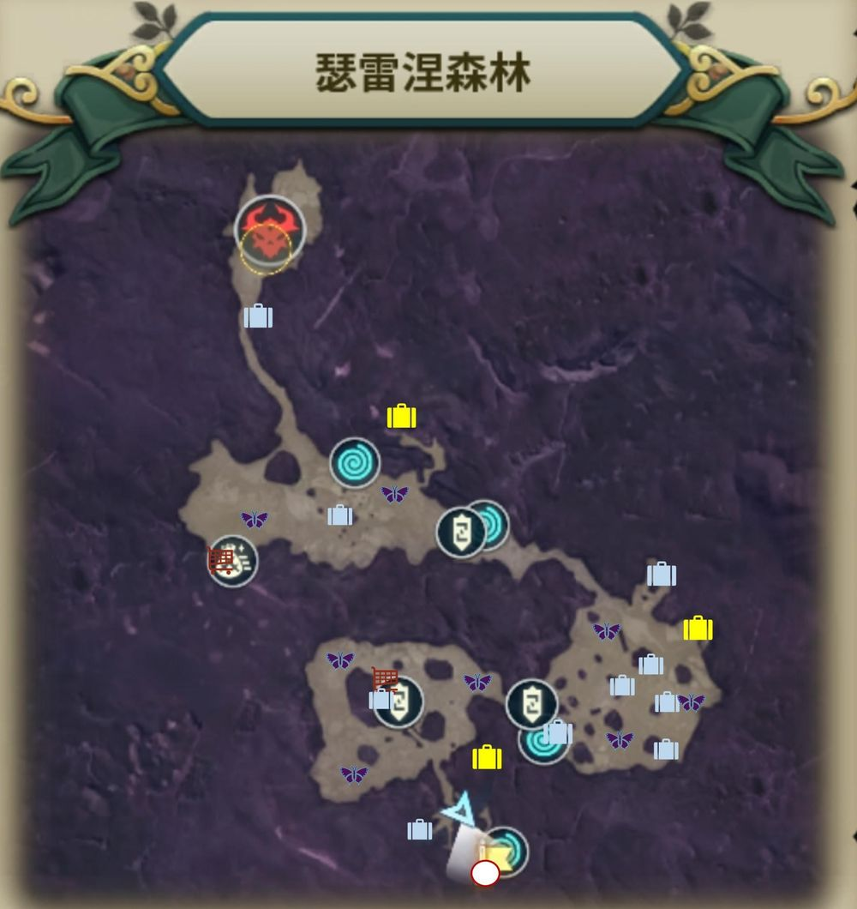

冒險紀錄
重複開啟
幻影蝴蝶

## 克雷納斯南部

## 克雷納斯東部

## 莫爾森林

## 瑟雷涅森林

## 亞雷克拉高原

<small>40等才能開寶箱/景點</small>

## 風之峽谷

<small>45等才能開寶箱/景點</small>

## 柯艾路可雪原

<small>55等才能開寶箱/景點</small>

## 普利茲摩爾冰河地帶

<small>60等才能開寶箱/景點</small>

## 塔歐勒沙漠

<small>70等才能開寶箱/景點</small>

## 魔女之森

<small>75等才能開寶箱/景點</small>

## 克羅馬魯荒野

<small>80等才能開寶箱/景點</small>

## 彩虹山谷

<small>85等才能開寶箱/景點</small>

> [!NOTE]
> 資料來源: [巴哈](https://forum.gamer.com.tw/C.php?bsn=37619&snA=1316)  
> 整理者: [獨角獸](https://home.gamer.com.tw/homeindex.php?owner=D0857422)  
> 上次更新: {docsify-updated}  
> 更新者: {{editor}}
